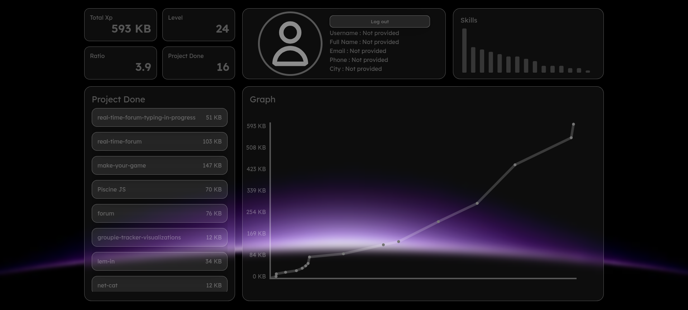

# GraphQL

<div align="center">
<p align="center">
  <a href="https://skillicons.dev">
    
  </a>
</p>

<h3>Interactive GraphQL Student Profile Dashboard</h3>

<p>
A modern profile dashboard built using GraphQL, JWT Authentication, SVG statistics, and modular Vanilla JavaScript architecture.
</p>

</div>

---

#  Table of Contents

- [About The Project](#about-the-project)
- [Features](#features)
- [Technologies Used](#technologies-used)
- [Project Structure](#project-structure)
- [Authentication](#authentication)
- [Installation](#installation)
- [Running The Project](#running-the-project)
- [Hosting](#hosting)
- [Screenshots](#screenshots)
- [Author](#author)

---

# About The Project

This project is a complete **GraphQL Profile Dashboard** developed as part of the GraphQL module.

The application allows authenticated users to:

* Login securely using JWT authentication
* Fetch personal data from a GraphQL API
* Display profile information dynamically
* Visualize statistics using SVG graphs
* Track XP progression and achievements

The project is entirely built using **Vanilla JavaScript**.

---

#  Features

### Authentication

* Login using:
  * Username + Password
  * Email + Password
* JWT Authentication
* Session persistence using LocalStorage

### User Dashboard

Displays:
* User information
* XP amount
* Grades
* Skills
* Progress statistics

### Statistics

Interactive SVG graphs including:

* XP progression over time
* XP earned by project
* Audit ratio
* Skill distribution

---

# Technologies Used

| Technology   | Purpose              |
| ------------ | -------------------- |
| GraphQL      | Data querying        |
| JWT          | Authentication       |
| JavaScript   | Application logic    |
| SVG          | Statistics rendering |
| HTML5        | Page structure       |
| CSS3         | Styling              |

---

# Project Structure

```bash
.
├── index.html
├── js
│   ├── app
│   │   └── app.js
│   ├── render
│   │   ├── profile_render.js
│   │   ├── signin_render.js
│   │   └── userdata_render.js
│   ├── services
│   │   ├── getuserdata_services.js
│   │   ├── logout_services.js
│   │   └── signin_services.js
│   ├── utils
│   │   ├── graphql.js
│   │   ├── svg.js
│   │   ├── tobase64.js
│   │   └── xpformat.js
│   └── views
│       ├── profile_page.js
│       └── signin_page.js
└── static
    ├── assets
    │   └── ...
    └── css
        └── style.css
```

---

# Authentication

The application authenticates users using JWT.

#### Authentication Flow

```text
User Login
    ↓
Encode Credentials (Base64)
    ↓
POST Request → https://learn.zone01oujda.ma/api/auth/signin
    ↓
Receive JWT Token
    ↓
Store Token
    ↓
Authorized GraphQL Requests
```

---

# Installation

### Clone Repository

```bash
git clone https://github.com/yassinebourazza/GraphQL.git

cd GraphQl
```


### Run Locally

Open:

```bash
index.html
```


1. Open the application
2. Login using your credentials (fake user --> username: t01 / password: Test1234@ب)
3. JWT token is generated
4. GraphQL data is fetched
5. Statistics render dynamically

---

# Screenshots

### Login Page


### Dashboard


---

#  Hosting

This project is currently deployed and hosted on:

https://graphxjs.netlify.app

---

# Author

 Yassine Bourazza

### GitHub
  
 [github.com/yassinebourazza](https://github.com/yassinebourazza?utm_source=chatgpt.com)
